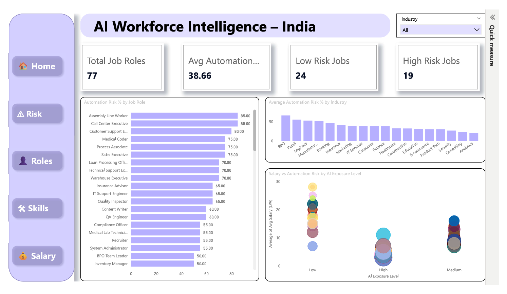
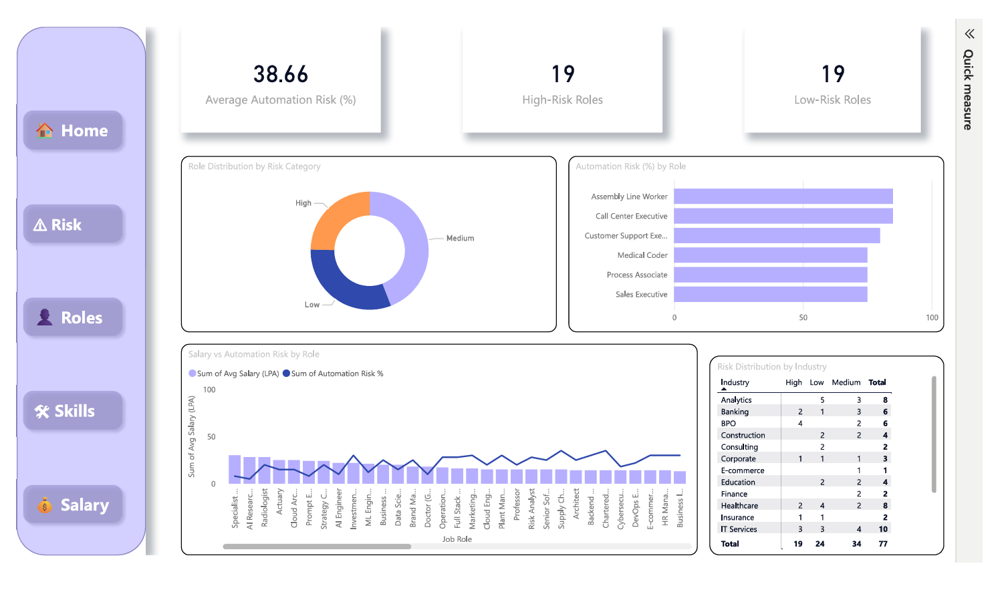
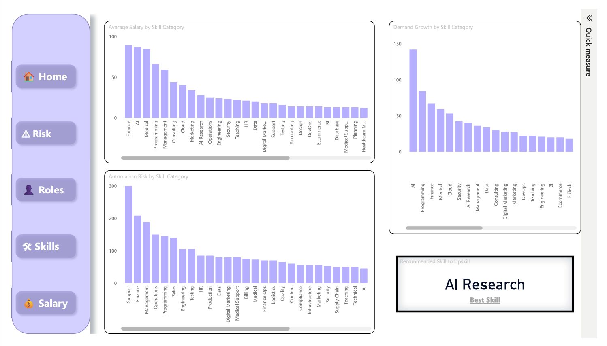
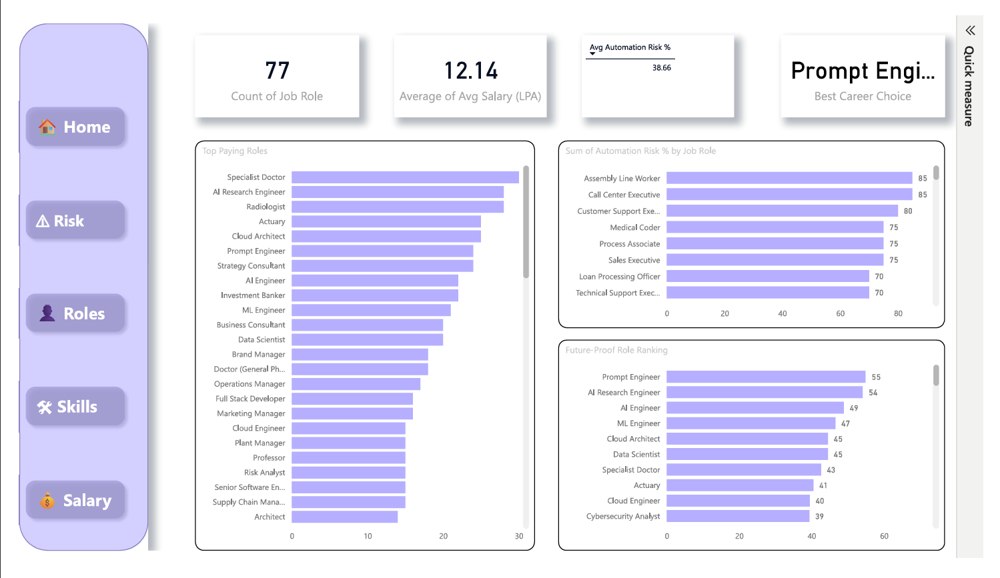
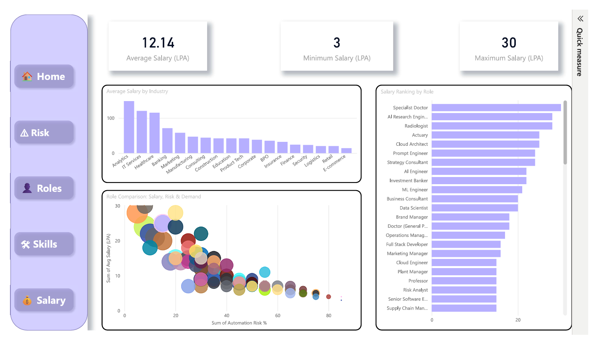

#  AI Workforce Intelligence – India

##  Project Overview

This project analyzes the impact of Artificial Intelligence on job roles, salaries, automation risk, and skill demand across major industries in India.
The goal is to simulate a real-world workforce analytics use case using Power BI and advanced DAX modeling.

---

##  Key Business Questions Answered

- Which job roles are most exposed to automation?
- Which industries carry the highest AI risk?
- What are the highest-paying roles?
- Which skills show strong demand growth?
- What are the most future-proof careers in India?

---

##  Tools & Technologies Used

- Power BI
- DAX (Advanced Measures)
- Data Modeling
- Excel (Data Preparation)
- KPI Design & Interactive Filtering

---

## 📸 Dashboard Preview

### Home Page – Executive Overview

---

### Risk Analysis Page

---

### Roles Intelligence Page

---

### Skills Intelligence Page

---

### Salary Insights Page

## Dashboard Features

### 1️.Automation Risk Analysis
- Risk category distribution
- Automation risk by job role
- Industry-wise automation exposure

### 2️.Salary Insights
- Top paying roles
- Salary comparison by industry
- Salary vs AI exposure level

### 3️.Skill Intelligence
- Demand growth by skill category
- Automation risk by skill
- Future Skill Score (Custom DAX model)

### 4️.Career Scoring Model
A custom scoring model combining:
- Demand Growth %
- Automation Risk %
- Average Salary

Used to identify:
- Future-proof careers
- High potential skills

---

## Key Insights

- High salary does not always mean low automation risk.
- AI-focused and data-driven roles show strong growth potential.
- Some traditional operational roles show high automation exposure.
- Balanced roles (high growth + low risk + good salary) are future-ready.

---

## Dataset Description

The dataset includes:

- Job Role
- Industry
- Automation Risk %
- Average Salary (LPA)
- AI Exposure Level
- Demand Growth %
- Skill Category
- Risk Category

---

## Project Type

End-to-end Business Intelligence project focused on workforce transformation analytics.
